# Habit Timer App

## Overview
This Flutter app is a habit, task, and recurrent task manager with a built-in timer. It utilizes the Bloc pattern for state management and stores data using Hive, a NoSQL database.

## Features
- Manage habits, tasks, and recurrent tasks
- Integrated timer for tracking task duration
- Bloc pattern for efficient state management
- Hive NoSQL Database for data persistence

## Screenshots
<table>
  <tr>
    <td align="center">
      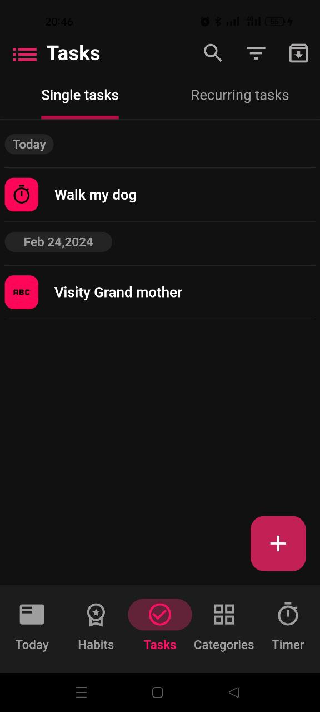
      <br>
      Screenshot 1
    </td>
    <td align="center">
      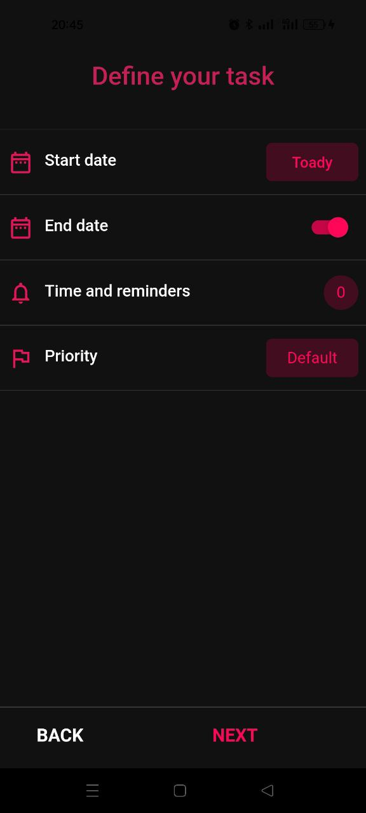
      <br>
      Screenshot 2
    </td>
    <td align="center">
      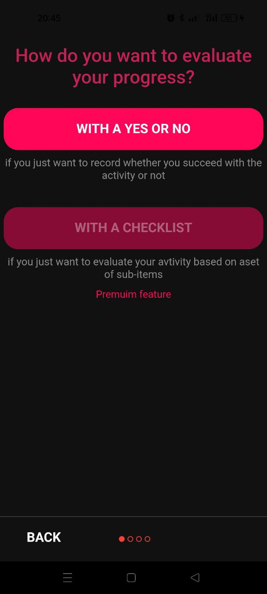
      <br>
      Screenshot 3
    </td>
    <td align="center">
      
      <br>
      Screenshot 4
    </td>
  </tr>
  <tr>
    <td align="center">
      
      <br>
      Screenshot 5
    </td>
    <td align="center">
      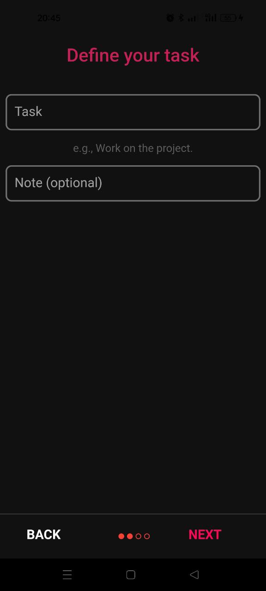
      <br>
      Screenshot 6
    </td>
    <td align="center">
      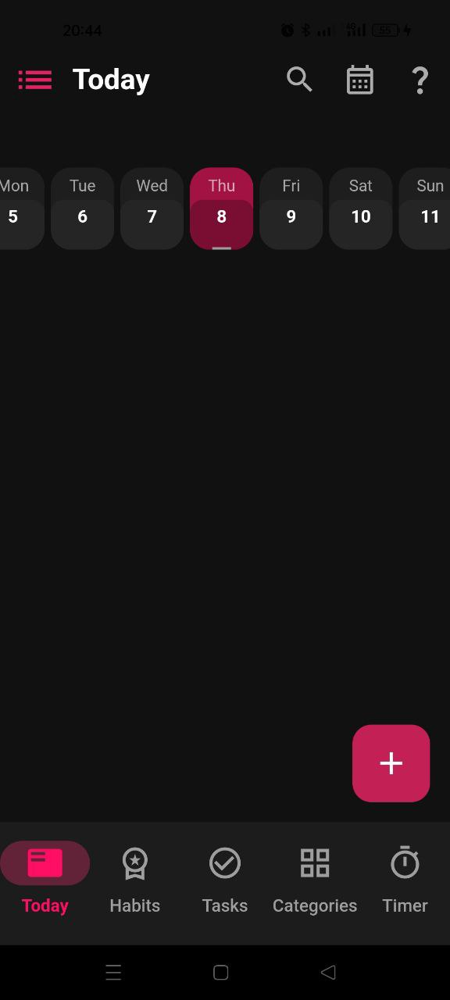
      <br>
      Screenshot 7
    </td>
    <td align="center">
      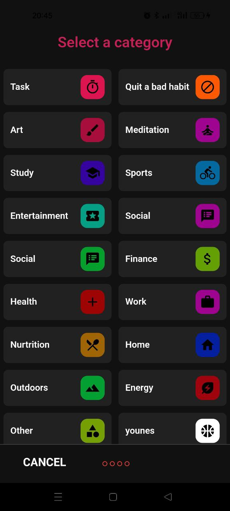
      <br>
      Screenshot 8
    </td>
  </tr>
  <tr>
    <td align="center">
      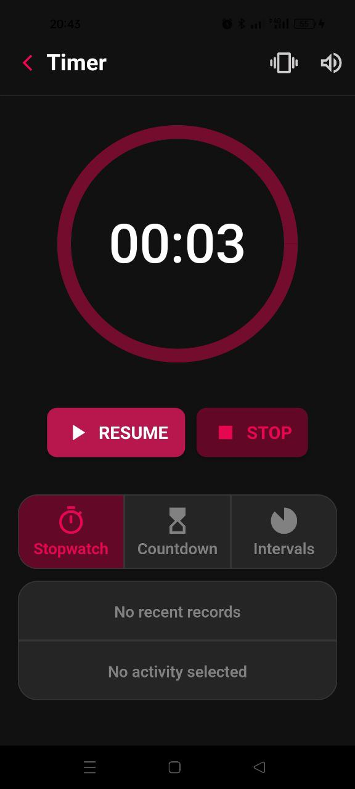
      <br>
      Screenshot 9
    </td>
    <td align="center">
      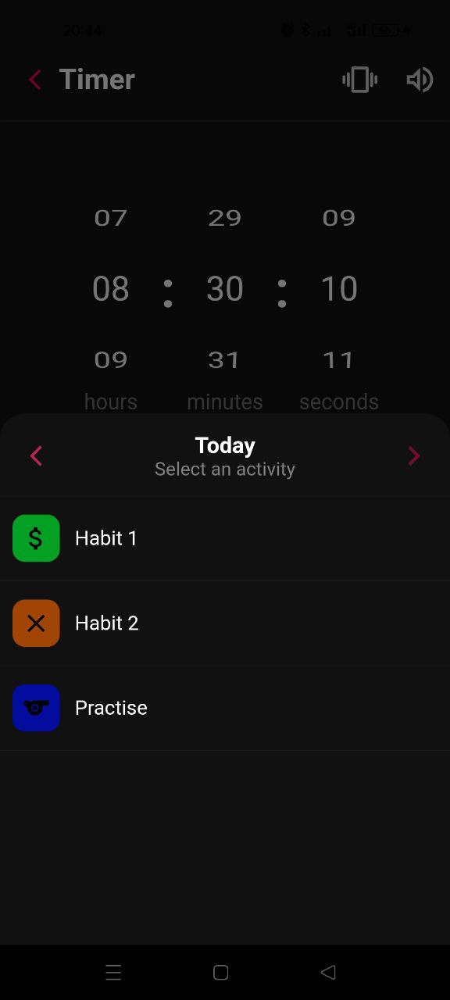
      <br>
      Screenshot 10
    </td>
    <td align="center">
      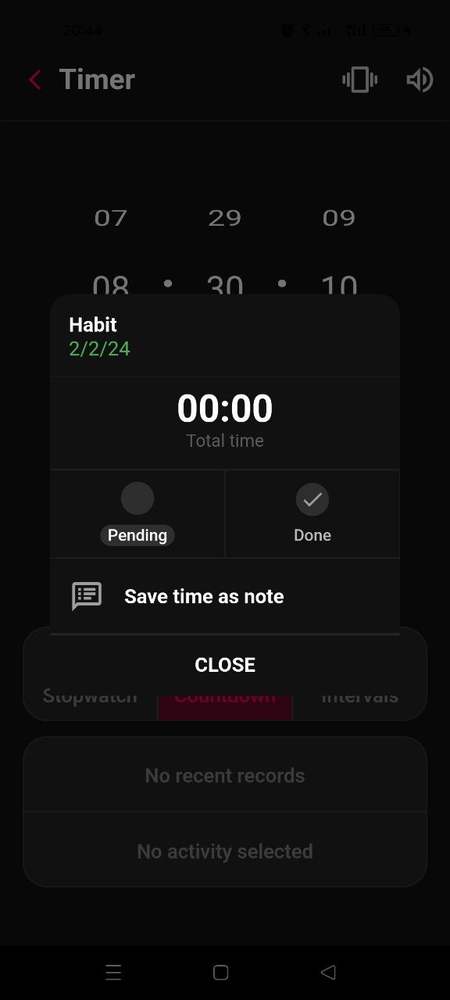
      <br>
      Screenshot 11
    </td>
    <td align="center">
      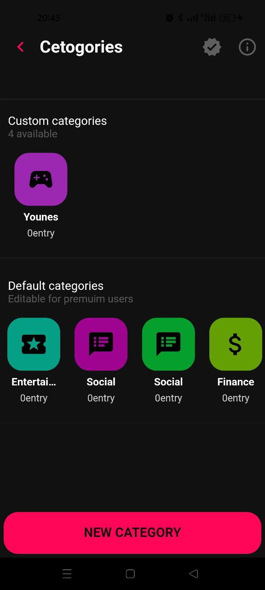
      <br>
      Screenshot 12
    </td>
  </tr>
  <tr>
    <td align="center">
      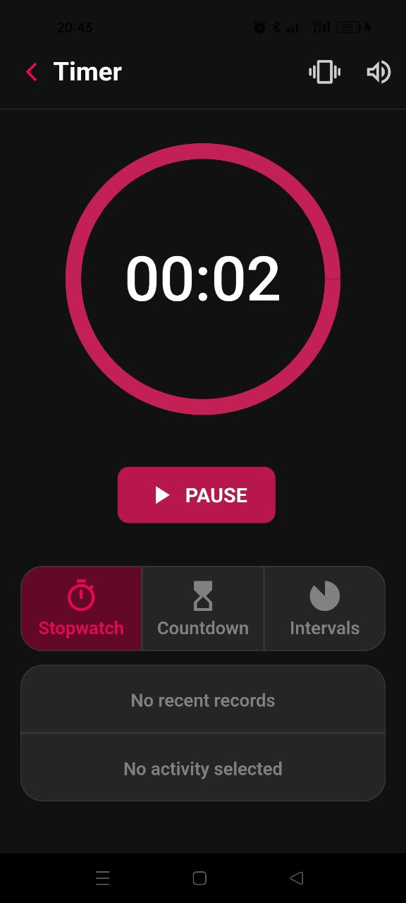
      <br>
      Screenshot 13
    </td>
    <td align="center">
      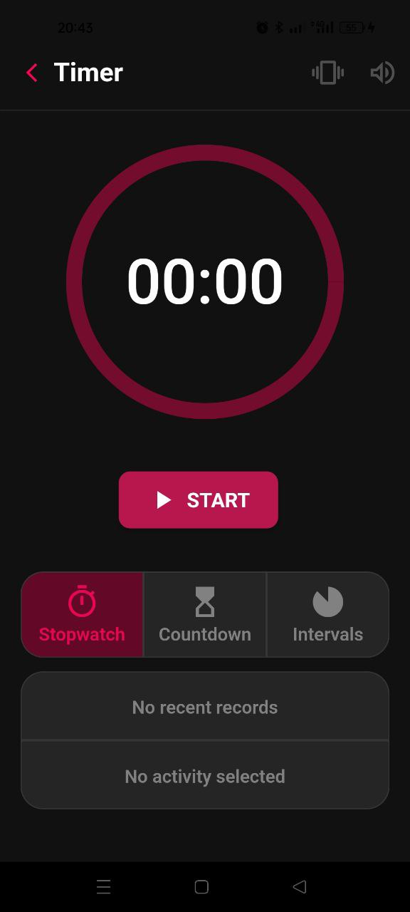
      <br>
      Screenshot 14
    </td>
    <td align="center">
      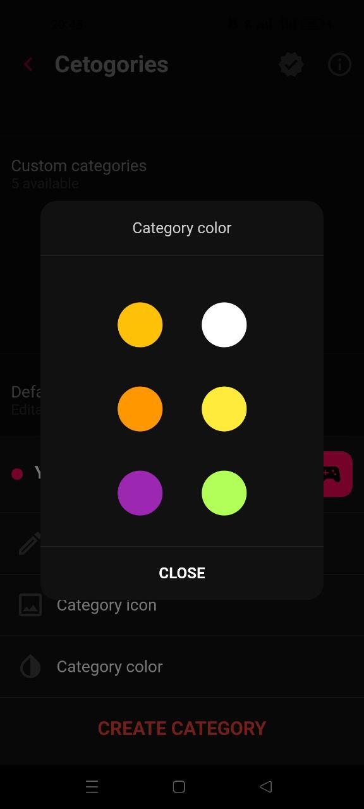
      <br>
      Screenshot 15
    </td>
    <td align="center">
      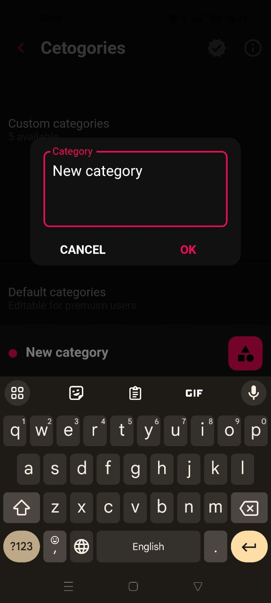
      <br>
      Screenshot 16
    </td>
  </tr>
  <tr>
    <td align="center">
      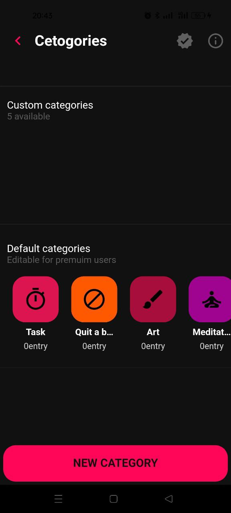
      <br>
      Screenshot 17
    </td>
    <td align="center">
      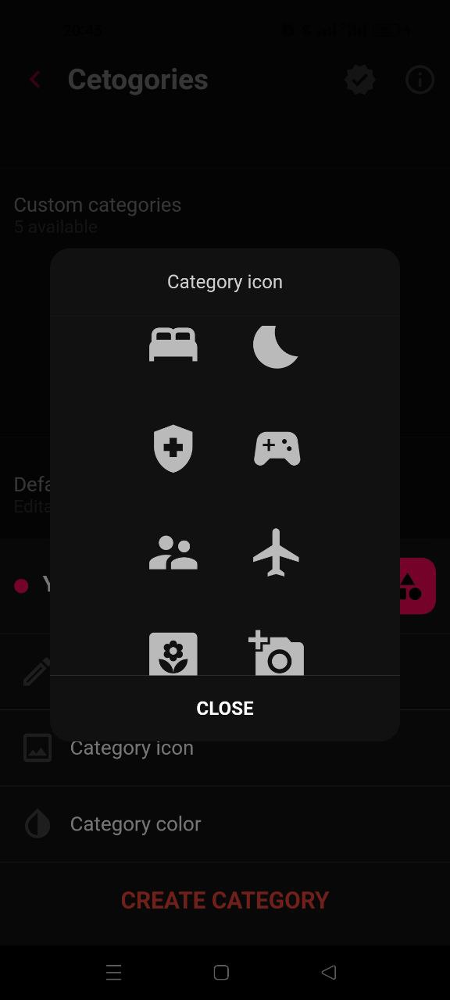
      <br>
      Screenshot 18
    </td>
    <td align="center">
      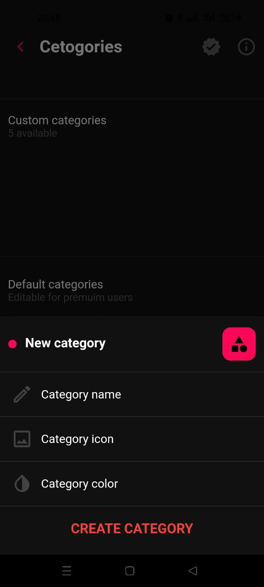
      <br>
      Screenshot 19
    </td>
    <td align="center">
      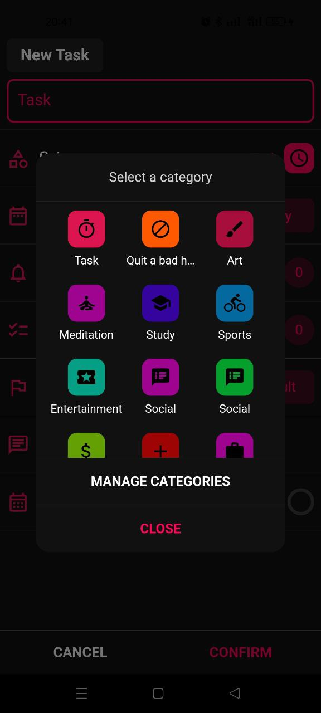
      <br>
      Screenshot 20
    </td>
  </tr>
  <tr>
    <td align="center">
      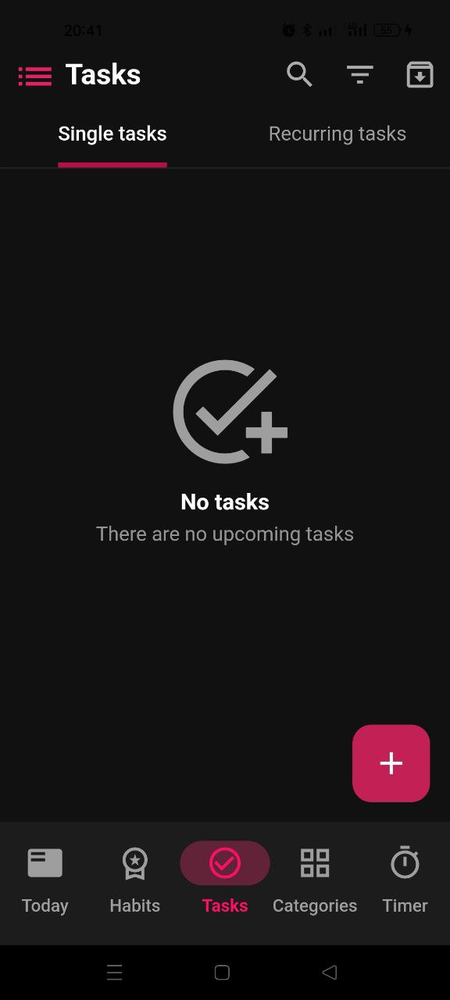
      <br>
      Screenshot 21
    </td>
    <td align="center">
      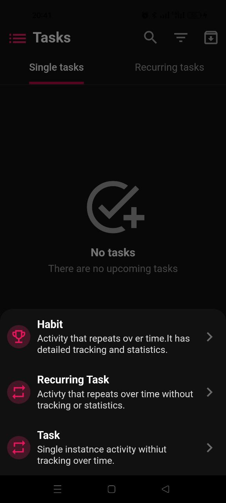
      <br>
      Screenshot 22
    </td>
    <td align="center">
      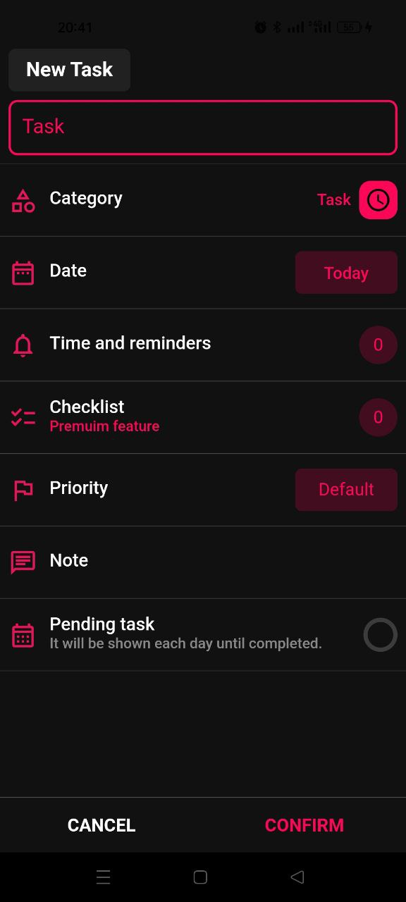
      <br>
      Screenshot 23
    </td>
    <!-- Add more columns if needed -->
  </tr>
</table>


## Getting Started
To run the app locally, follow these steps:

1. Clone the repository:
```bash
   git clone https://github.com/your-username/habit-timer-app.git
```
2. Navigate to the project folder:
```bash
Copy code
cd habit-timer-app
```
3. Install dependencies:
```bash
Copy code
flutter pub get
```
4. Run the app:

```bash
Copy code
flutter run
```
## Dependencies

## Dependencies
- Flutter
- Dart
- Bloc
- Hive

## Contributing

Contributions are welcome! If you'd like to contribute to this project, please follow these guidelines:

1. **Fork the repository.**
2. **Create a new branch for your feature/bugfix:** `git checkout -b feature-name`
3. **Make your changes and commit them:** `git commit -m 'Description of changes'`
4. **Push to the branch:** `git push origin feature-name`
5. **Open a pull request.**

## License

This project is licensed under the [MIT License](LICENSE).

## Acknowledgments

Thanks to the Flutter, Bloc, and Hive communities for providing excellent tools and documentation.
